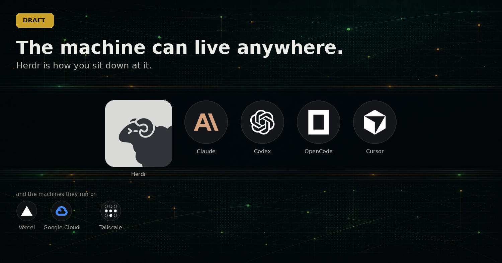

# DRAFT — The machine can live anywhere. Herdr is how you sit down at it.

**Status: draft.** Not on Medium or DEV.to yet.



Sequel to [Your AI Coding Agent Deserves Its Own Cloud Machine](https://dev.to/timtech4u/your-ai-coding-agent-deserves-its-own-cloud-machine-1ino).

**Canonical:** [article.md](article.md)  
**Medium-ready (still a draft):** [medium.md](medium.md)

## Thesis

Compute is everywhere now: a Vercel Sandbox, a Grok Bot computer, a Cursor VM, a Hetzner box, a GPU pod. Those products give you a machine. [Herdr](https://herdr.dev) `--remote` is how you sit down at any of them without changing the ritual.

```bash
herdr --remote box@grey
```

## Images

- `images/featured.png` — OG / Medium featured (Herdr, Claude, Codex, OpenCode, Cursor + Vercel, Google Cloud, Tailscale)
- `images/herdr-grok.png` — Herdr TUI on the remote box, Grok 4.6 in the pane
- `images/tailscale-machines.png` — the tailnet used as one SSH pipe

## License

Writing: [CC BY 4.0](LICENSE). Product marks belong to their owners and are used here for identification.
