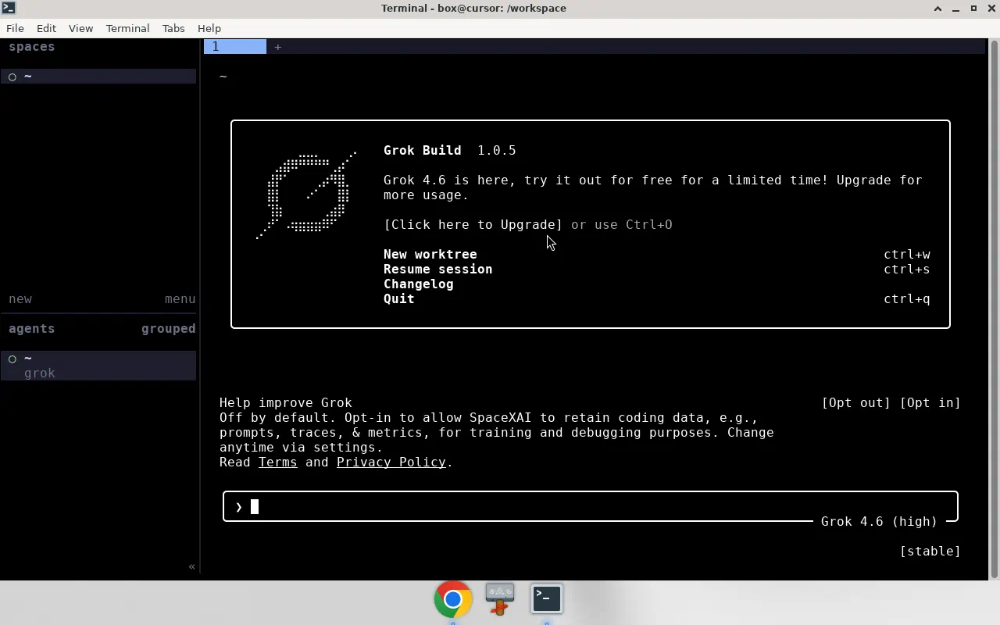
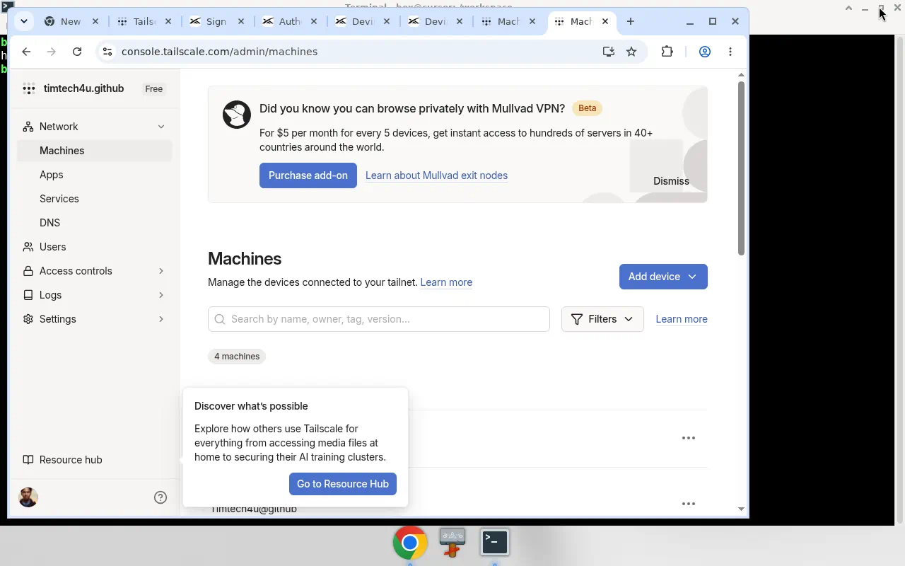

# The machine can live anywhere. Herdr is how you sit down at it.

In April I wrote that [your AI coding agent deserves its own cloud machine](https://dev.to/timtech4u/your-ai-coding-agent-deserves-its-own-cloud-machine-1ino). I meant it. I moved Claude Code onto a GCP VM, put it in tmux, tunneled ports back to localhost, and treated the laptop as a thin client. From my phone I checked on the agent while grabbing coffee.

That article was about *where the work runs*. This one is about *how you sit down at it*.

The missing piece is [Herdr](https://herdr.dev) — specifically `herdr --remote`.

Yesterday Duyet posted that he installed Tailscale and Herdr on a [Grok Bot](https://x.com/_duyet/status/2089665924454633766) computer, then attached from his Mac:

```bash
herdr --remote box@duyetbot
```

I did the same thing today, on a box named `grey`. One command from the MacBook. On the other side: a persistent Herdr server, a workspace, and Grok 4.6 already running.



I did not SSH in first and then remember tmux binds. I did not rebuild a layout. The session was already there.

That is the product.

## The gap after tmux

tmux keeps a shell alive. That is why I used it in April. Close the laptop, come back, `tmux attach`. It works.

What tmux does not do:

- know which pane is an agent
- tell you which one is blocked, working, idle, or done
- give you a thin client that feels like the machine is in front of you
- install itself on a fresh box with one command
- stream the same UI from a Vercel sandbox, a Grok Bot computer, a Cursor VM, or a Hetzner VPS without changing how you work

[Herdr's own compare page](https://herdr.dev/compare/) puts it cleanly: tmux sees panes. Herdr sees agents. Manager apps (Conductor, Emdash, the rest) put the herd in a window — quit the window, the herd goes with it. Herdr is the other way around. The server owns the terminals. Every UI is a client. Detach, crash the TUI, close the lid. The agents do not notice.

Can Celik, who built Herdr, said the quiet part in the [Y Combinator announcement](https://herdr.dev/blog/herdr-is-joining-y-combinator/) (F26, runtime stays Apache-2.0):

> Once you have the runtime, where they run stops mattering. You should be able to run them anywhere and keep them running.

And then the roadmap sentence that this post is really about:

> A laptop, a VPS for the six-hour job, a sandbox for risky code. Herdr can run anywhere today, but those machines are disconnected. They should be connected.

`--remote` is how they start connecting.

## What `--remote` actually is

Two official paths, from [How to work with Herdr](https://herdr.dev/docs/how-to-work/):

**1. SSH first, then Herdr** — tmux-style. Use this on a phone.

```bash
ssh you@server
herdr
```

**2. Thin client from the machine you are holding.** This is the one that feels like the box is local. Your Herdr talks SSH, starts or attaches the remote server, and streams the UI back. Local keybinds stay local. A screenshot on your Mac clipboard can land in the remote pane.

```bash
herdr --remote workbox
herdr --remote ssh://you@server:2222
herdr --remote box@grey
```

If the remote does not have Herdr yet, an interactive `--remote` will install it. Can's line: depending on the network, you are a couple of seconds from an agent running.

Detach with `ctrl+b q`. The server stays. Reattach with the same command.

That is the inversion. The laptop is no longer the computer. The laptop is the chair.

## The menu of machines

Compute got cheap and weird. You can rent a place for an agent in a dozen shapes before lunch. None of these are theoretical — they all speak SSH, or something close enough.

| Where the box lives | What you get | How you reach it |
| --- | --- | --- |
| **Your laptop** | Fast UI, bad thermals | `herdr` |
| **A cloud VM** (GCP, AWS, Hetzner, Fly) | Always-on, you pay for the hour | `herdr --remote user@vm` |
| **[Vercel Sandbox](https://vercel.com/docs/sandbox)** | Firecracker microVM, persistent by default, SSH as of January 2026 | `sandbox ssh <id>` then `herdr`, or point `--remote` at that SSH |
| **Grok Bot's computer** | A real Linux box next to the chat | Tailscale (or any SSH) + `herdr --remote box@grey` |
| **Cursor cloud / cloud agent VM** | A throwaway machine that already has the repo | SSH if the environment exposes it, then Herdr |
| **A GPU pod** | The job that should not run on a MacBook | Same `--remote` |
| **Your phone** | No Herdr app required | Any SSH client, then `herdr` — the TUI adapts |

The providers will keep multiplying. The attach command does not have to.

Vercel is the example people keep asking about, so here is the honest version. [Sandbox](https://vercel.com/docs/sandbox) is a Firecracker microVM for untrusted or agent-generated code. It is persistent by default: stop it, the filesystem snapshots, resume later. In January 2026 they shipped [`sandbox ssh`](https://vercel.com/changelog/ssh-into-running-sandboxes-with-the-sandbox-cli). While you are connected, the timeout extends in 5-minute increments, up to five hours. That is not a 24/7 VPS. It is a scratch computer you can actually sit down at. Put Herdr on it and the session outlives the tab you used to create the sandbox — for as long as the sandbox itself is allowed to live.

Grok Bot, Cursor Cloud, Codespaces, a home lab: same pattern. The product gives you a machine. Herdr gives you a place to inhabit it with the agent UI you already use.

## A worked example: Grok Bot + Tailscale + a Mac

I am not going to pretend this is the only way. It is the way I actually did it today, after Duyet's tweet.

**On the box** (the Grok Bot computer — Debian, user `box`):

```bash
# Herdr
curl -fsSL https://herdr.dev/install.sh | sh
herdr server          # headless is enough; or just `herdr`

# Grok Build, or Claude, or Codex — Herdr does not wrap them
grok
```

**A pipe.** `--remote` is SSH. I used Tailscale because the box has no public IP I wanted to open. Install Tailscale on the box and the Mac, join the *same* tailnet, enable Tailscale SSH. Hostname: `grey`.



If you mix Google and GitHub identities, you will land on two tailnets and the machines will not see each other. I did that. Fix: pick the identity your laptop already uses.

**On the Mac:**

```bash
herdr --remote box@grey
# if MagicDNS misses:
herdr --remote box@100.70.59.5
```

Grok was already in the session. The sidebar showed `~ / grok`. I did not start it from the laptop.

**The catch, because this is a Grok Bot computer and not a VPS:** closing the chat is fine. Quitting Grok Bot, or anything that sleeps or recreates that computer, is not. `herdr --remote` talks to the box, not to your Mac. If the box is gone, `grey` disappears from Tailscale. We already watched a restart wipe the Tailscale package once. Treat Grok Bot as a convenient host, not an SLA.

For a real always-on herd, use a VM you control. The attach command stays the same.

## How I work now

Morning, on the Mac:

```bash
herdr --remote box@grey
```

The workspace is where I left it. Agents that ran overnight are either done, blocked, or still working. I do not hunt panes.

A throwaway repro? Vercel Sandbox, `sandbox ssh`, `herdr`, do the dangerous thing, snapshot or kill it.

A six-hour eval? The GPU box. Same `--remote`.

Phone? `ssh box@grey` then `herdr`. [Official docs](https://herdr.dev/docs/how-to-work/): no mobile app required. moshi works on iPhone.

Named sessions if one host has two herds:

```bash
herdr --remote box@grey --session agents
```

Repeat targets go in SSH config so you stop typing users and ports:

```
Host grey
  HostName 100.70.59.5
  User box
```

```bash
herdr --remote grey
```

## What this is not

It is not "SSH, but pretty." It is a runtime with clients.

It is not a replacement for Cursor, Claude Code, Grok Build, or Codex. [Herdr does not wrap them.](https://herdr.dev) It owns their terminals.

It is not a reason to keep a Grok Bot chat open 24/7. Put Herdr on the machine that is allowed to stay up.

It is not locked to Tailscale. WireGuard, a public SSH port, a Vercel sandbox SSH session, a `Host` block — if `ssh you@host` works, `herdr --remote you@host` works.

## Quick reference

| What | Command |
| --- | --- |
| Install Herdr | `curl -fsSL https://herdr.dev/install.sh \| sh` |
| Local session | `herdr` |
| Detach | `ctrl+b q` |
| Stop the server | `herdr server stop` |
| Thin-client remote | `herdr --remote user@host` |
| Phone / plain SSH | `ssh user@host` then `herdr` |
| Named remote session | `herdr --remote host --session agents` |
| Vercel scratch box | `sandbox ssh <id>` then `herdr` |
| This writeup's host | `herdr --remote box@grey` |

The April article was: give the agent a machine, put tmux on it, make the laptop thin.

This one is: the machines are already everywhere. Herdr is how you sit down at any of them without changing the ritual.

The chair is portable. Put it on every computer you actually want to use.

---

*Sources: [herdr.dev](https://herdr.dev), [How to work with Herdr](https://herdr.dev/docs/how-to-work/), [Persistence and remote](https://herdr.dev/docs/persistence-remote/), [Compare](https://herdr.dev/compare/), [Herdr joins YC](https://herdr.dev/blog/herdr-is-joining-y-combinator/), [Vercel Sandbox](https://vercel.com/docs/sandbox), [Sandbox SSH changelog](https://vercel.com/changelog/ssh-into-running-sandboxes-with-the-sandbox-cli) (15 Jan 2026), [Duyet's tweet](https://x.com/_duyet/status/2089665924454633766) (18 Aug 2026). Screenshots from my Grok Bot computer, 19 Aug 2026.*
